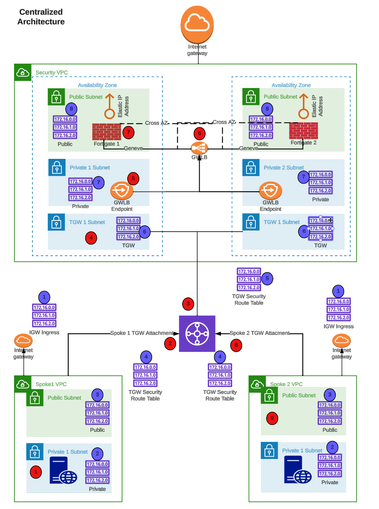

# How to Demo and Sell FortiGate Autoscale in AWS

# Reference Diagram for the Workshop
    * Centralized Egress + East-West

    * Distributed Ingress + Egress

    * Routes and Hops

## Welcome!

In this TEC Recipe, you will learn how to deploy a FortiGate autoscale group using the templates found in this github repository: https://github.com/fortinetdev/terraform-aws-cloud-modules.git. Fortinet customers can use this service to protect AWS workloads deployed in the cloud. Later sections in the TEC Recipe will demonstrate the use of common architecture patterns to protect different types of ingress, egress, and East-West traffic. The last section of the workshop will teach you how to deploy a FortiGate autoscale group into an existing customer environment. 

This TEC Recipe is intended to help accomplish the following:

  * Learn common AWS networking concepts such as routing traffic in and out of VPCs for various traffic flows
  * Use AWS Cloudshell and Terraform to deploy a demo environment
  * Interact with FortiGate GUI and CLI, to build security policy sets, and deploy them
  * Test traffic flows in an example environment and use FortiGate deployed as an autoscale group to control 
    traffic flows
  * Deploy a FortiGate Autoscale Group into an existing customer environment. This is different from deploying a FortiGate Autoscale Group in a demo environment, as it requires the use of existing AWS resources and VPCs. This would be a common use case for a customer who wants to protect their existing AWS workloads with FortiGate Autoscale Group.

## Learning Objectives

At the end of this TEC Recipe, you will complete the following objectives:
  
  * Understand AWS Networking Concepts *(10 minutes)*
  * Understand AWS Common Architecture Patterns *(10 minutes)*
  * Use AWS Cloudshell and Terraform to deploy a demo environment *(10 minutes)*
  * Deploy a FortiGate Autoscale Group to control a distributed ingress architecture *(20 minutes)*
  * Create a policy set and apply it to a FortiGate Autoscale Group *(10 minutes)*
  * Test traffic flows (distributed in + egress) *(20 minutes)*
  * Destroy the resources for the distributed egress architecture *(10 minutes)*
  * Deploy a FortiGate Autoscale Group into an existing customer environment *(20 minutes)*

## TEC Recipe Components

These are the AWS and Fortinet components that will be used during this workshop:

  * AWS Marketplace
  * AWS CloudShell
  * Hashicorp Terraform Templates (Infrastructure as Code, IaC)
  * AWS SDN (AWS intrinsic router and route tables in a VPC)
  * AWS Gateway Load Balancer (GWLB)
  * AWS Transit Gateway (TGW)
  * AWS EC2 Instances (Ubuntu Linux OS)

## AWS Reference Architecture Diagram

This is the architecture and environment that will be used in the workshop.

  * With AWS networking, there are several ways to organize your AWS architecture to take advantage of FortiGate CNF traffic inspection. The important point to know is that as long as the traffic flow has a symmetrical routing path (for forward and reverse flows), the architecture will work.
  * This diagram will highlight two main designs that are common architecture patterns for securing traffic flows.
  * Distributed Ingress + Egress**
  * Centralized Egress + East-West**

