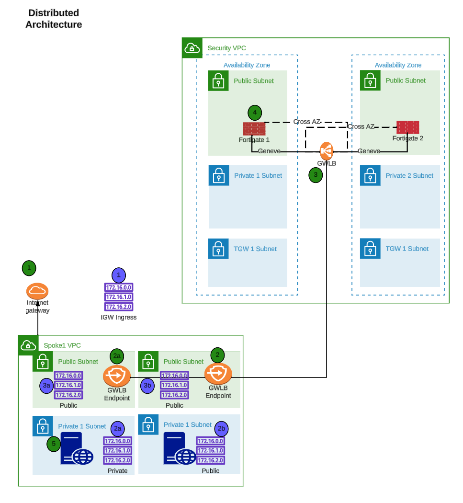
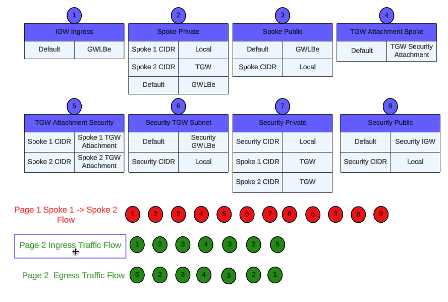
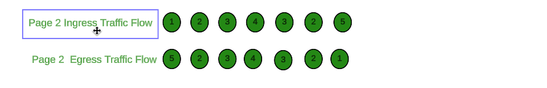

# How to Demo and Sell FortiGate Autoscale in AWS

## Welcome!

In this TEC Recipe, you will learn how to deploy a FortiGate autoscale group using the templates found in this github repository: https://github.com/fortinetdev/terraform-aws-cloud-modules.git. 

Fortinet customers can use this service to protect AWS workloads deployed in the cloud. Later sections in the TEC Recipe will demonstrate the use of the distributed egress architecture to protect ingress and egress traffic in a existing customer workload vpc. 

This TEC Recipe is intended to help accomplish the following:

  * Learn common AWS networking concepts such as routing traffic in and out of VPCs for various traffic flows
  * Use AWS Cloudshell and Terraform to deploy a demo environment
  * Interact with FortiGate GUI and CLI, to build security policy sets and deploy them
  * Test  a couple of traffic flows in an example environment and use FortiGate deployed as an autoscale group to control traffic
  * Deploy a FortiGate Autoscale Group into an existing customer environment. 

## Learning Objectives

At the end of this TEC Recipe, you will complete the following objectives:
  
  * Understand AWS Networking Concepts *(10 minutes)*
  * Understand AWS Common Architecture Patterns *(10 minutes)*
  * Use AWS Cloudshell and Terraform to deploy a demo environment *(10 minutes)*
  * Deploy a FortiGate Autoscale Group to control a distributed egress architecture *(20 minutes)*
  * Create a policy set and apply it to a FortiGate Autoscale Group *(10 minutes)*
  * Test traffic flows (distributed ingress + egress) *(20 minutes)*
  * Use terraform to destroy the fortigate autoscale group (25 minutes)
  * Use terraform to destroy the resources for the distributed egress architecture *(10 minutes)*

## TEC Recipe Components

These are the AWS and Fortinet components that will be used during this workshop:

  * AWS Marketplace
  * AWS CloudShell
  * Hashicorp Terraform Templates (Infrastructure as Code, IaC)
  * AWS SDN (AWS intrinsic router and route tables in a VPC)
  * AWS Gateway Load Balancer (GWLB) and associated endpoints
  * AWS EC2 Instances (Ubuntu Linux OS)
  * A hybrid licensed Fortigate Autoscale Group. (BYOL for perpetual instances and PAYGO for autoscale instances)

## Related Mantis Links

  * https://mantis.fortinet.com/bug_view_page.php?bug_id=1021311
  * https://mantis.fortinet.com/bug_view_page.php?bug_id=1021306
  * https://mantis.fortinet.com/bug_view_page.php?bug_id=0971675 (resolved with build 11)

## AWS Reference Architecture Diagram

This is the architecture and environment that will be used in the workshop.

  * With AWS networking, there are several ways to organize your AWS architecture to take advantage of FortiGate Autoscale Group traffic inspection. The important point to know is that as long as the traffic flow has a symmetrical routing path (for forward and reverse flows), the architecture will work.
  * This diagram will highlight distrubuted designs that are common architecture patterns for securing traffic flows.
  * Distributed Ingress + Egress

# Reference Diagram for the Workshop

  * Distributed Ingress + Egress

  * Routes and Hops

* This diagram is showing TGW subnets in the security VPC. These subnets are not used in this workshop, but TGW subnets are used in a centralized egress architecture. The TGW subnnets are where the TGW Attachments are associated in this architecture. Since the same Fortigate Autoscale Group can be used to inspect traffic from both architectures simultaneously, these subnets are still included in the diagram. 