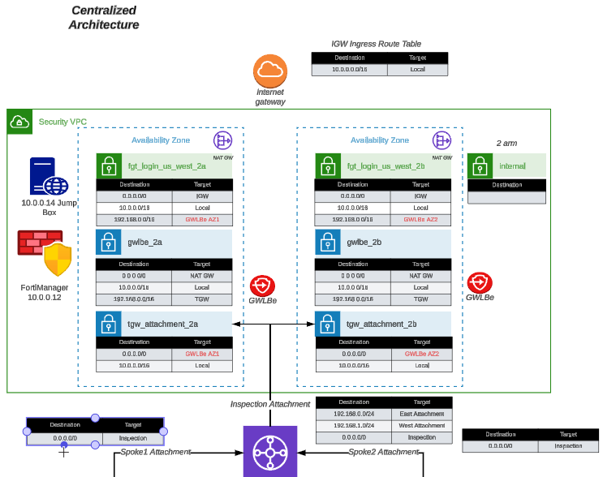

While there are many ways to organize your infrastructure, there are two main ways to design your networking when using GWLB: 
* centralized 
* distributed. 

We will discuss this further below.

FortiGate Autoscale uses FortiGates on the backend and routes all traffic through the Fortigates for traffic inspection. AWS GWLB, and GWLB endpoints to intercept customer traffic and inspect this traffic transparently. As part of the deployment process for FortiGate Autoscale instances, the customer environment will need to implement VPC and ingress routing at the IGW to intercept the traffic to be inspected.

The FortiGate Autoscale security stack, which includes the AWS GWLB and other components, will be deployed in a centralized inspection VPC. The details of the diagram are simply an example of the main components used in FortiGate Security VPC Autoscale stack. 

The following diagrams and paragraphs will explain what happens when customer traffic is received at the FortiGate Autoscale GWLB.

Decentralized designs do not require any routing between the protected VPC and another VPC through TGW. These designs allow simple service insertion with minimal routing changes to the VPC route table. The **yellow numbers** show the initial packet flow for a session and how it is routed (using ingress and VPC routes) to the GWLBe endpoint which then sends traffic to the FortiGate CNF stack. The **blue numbers** show the returned traffic after inspection by the FortiGate CNF stack.

Centralized designs require the use of TGW to provide a simple hub and spoke architecture to inspect traffic. These can simplify east-west and egress traffic inspection needs while removing the need for IGWs and NAT Gateways to be deployed in each protected VPC for egress inspection. You can still mix a decentralized architecture to inspect ingress and even egress traffic while leveraging the centralized design for all east-west inspection.

The **yellow numbers** show the initial packet flow for a session and how it is routed (using ingress, VPC routes, and TGW routes) to the GWLBe which then sends traffic to the FortiGate Autoscale stack. The **blue numbers (east-west)** and **purple numbers (egress)** show the returned traffic after inspection by the FortiGate Autoscale Group.

