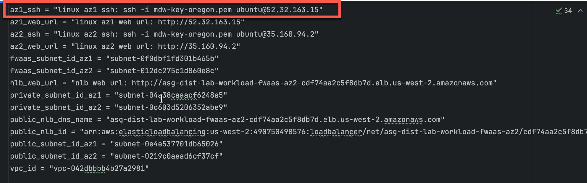
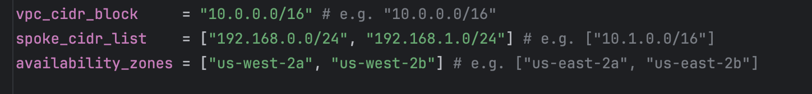
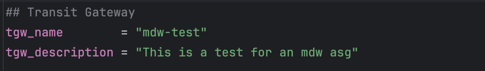
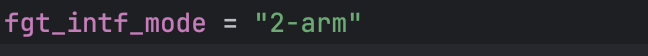
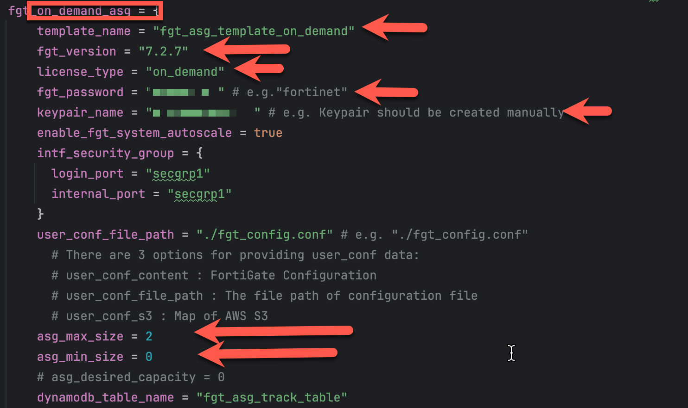
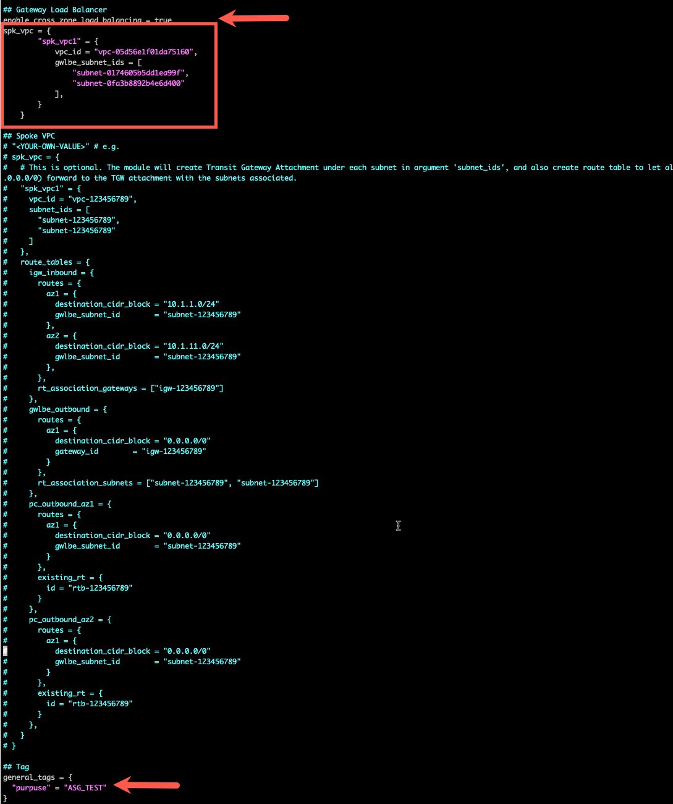
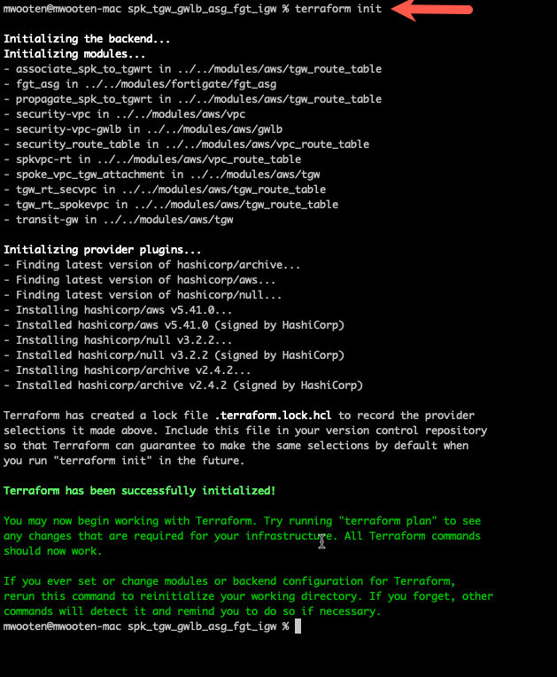
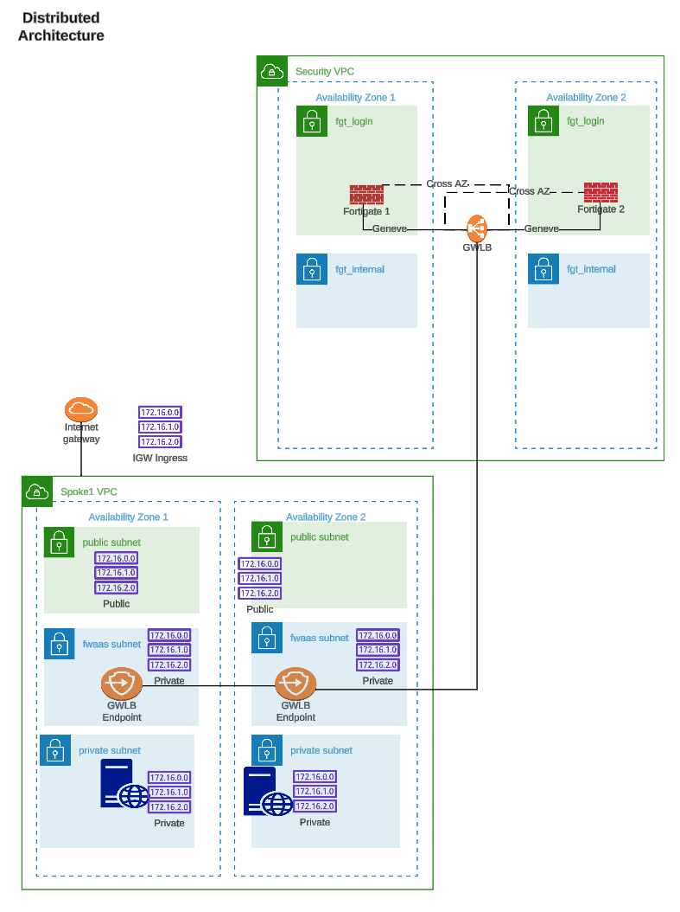

* Log into your AWS account and navigate to the [**Console Home**](https://us-west-2.console.aws.amazon.com/console/home?region=us-west-2#).

{}
**Note:** Make sure you are running this workshop in the intended region. The defaults are configured to run this workshop in us-west-2 (Oregon). Make sure your management console is running in us-west-2 (Oregon), unless you intend to run the workshop in a different FortiGate CNF supported region.
{}



* Click on the AWS CloudShell icon on the console navigation bar


* Clone a repository that uses terraform to create a distributed ingress workload vpc

  ``` git clone https://github.com/fortinetdev/terraform-aws-cloud-modules.git ```

* Change directory into the newly created repository and move to the examples/spk_tgw_gwlb_asg_fgt_igw directory. This directory will deploy a standard centralized egress architecture with a FortiGate Autoscale group. 

  ``` cd terraform-aws-cloud-modules/examples/spk_tgw_gwlb_asg_fgt_igw ```
  
* Copy the terraform.tfvars.example to terraform.tfvars

  ``` cp terraform.tfvars.txt terraform.tfvars ```
  


* Edit the terraform.tfvars file. If you are using AWS Cloudshell, then your credentials are already exported into the shell environment. If you are not using AWS Cloudshell, then I recommend exporting your AWS credentials into your environment and not hard-coding your credentials into the terraform.tfvars file. You can find more information here: https://docs.aws.amazon.com/cli/latest/userguide/cli-configure-envvars.html

{}
**Note:** You can find more information on exporting your AWS credentials into your environment here: https://docs.aws.amazon.com/cli/latest/userguide/cli-configure-envars.html
{}

{}
**Note:** Examples of preinstalled editors in the Cloudshell environment include: vi, vim, nano
{}

{}
**Note:** This task will create a Fortigate Autoscale deployment suitable for a customer demo environment. This environment is complete with a Transit Gateway (TGW) and complete spoke VPC's.
{}

{}
**Note:** Documentation for the template variables can be found here: https://github.com/fortinetdev/terraform-aws-cloud-modules/tree/main/examples/spk_tgw_gwlb_asg_fgt_igw
{}

* This workshop will assume your access_key and secret_key are already exported into your environment. Remove the "access_key" and "secret_key" lines and fill in the "region" you intend to use for your deployment.


* Fill in the cidr_block you want to use for the inspection VPC. 
* Fill in the cidr_block you want to use for each spoke_vpc. Create  the spoke_cidr_list as a terraform list. 
* Create a terraform list for the set of availability_zones you want to use.

* 

* Fill in a tgw_name and tgw_description. 

* 

* Fill in the desired fgt_intf_mode. 1-arm mode uses a single Fortigate ENI and hairpins the traffic in and out of the same ENI. 2-arm mode uses two Fortigate ENIs and allows for a more traditional routing configuration via a public and private interface. 
* This workshop will use the 2-arm mode. 



* Each Fortigate Autoscale deployment using standard BYOL and PayGo licensing will create 2 autosclale groups. The BYOL autoscale group will use the BYOL licenses found in the license directory. If more instances are needed to handle the load on the autoscale group, Fortigate Autoscale will scale-out using PayGo instances if all BYOL licenses are consumed. Lets fill in the BYOL section of the template.
* Fill in the byol section with values for the highlighted variables:
  * template_name = anything
  * fgt_version = desired fortios version
  * license_type = leave as byol
  * fgt_password = desired fortigate password when logging into the fortigate
  * keypair_name = keypair used for passwordless login
  * lic_folder_path = path to Fortigate byol licenses
  * asg_max_size = maximum number of instances in the autoscale group
  * asg_min_size = minimum number of instances in the autoscale group
  * asg_desired_capacity = desired number of instances in the autoscale group
  * leave the rest of the variables as is
  
  

* Fill in the on_demand (PayGo) section with values for the highlighted variables:
  * template_name = anything
  * fgt_version = desired fortios version
  * license_type = leave as on-demand
  * fgt_password = desired fortigate password when logging into the fortigate
  * keypair_name = keypair used for passwordless login
  * asg_max_size = maximum number of on-demand instances in the autoscale group
  * asg_min_size = minimum number of instances in the autoscale group
  * asg_desired_capacity = desired for paygo is meaningless. The on-demand will only scale as a result of an autoscale event. 
  * leave the rest of the variables as is
  
* The scale policies control the scaling of the autoscale groups. The scale policies are based on the average CPU utilization of the autoscale group. The scale policies are set to scale out when the average CPU utilization is greater than 80% and scale in when the average CPU utilization is less than 20%. The scale policies are set to scale out and in by 1 instance. This workshop will leave the scaling policies as is.

  

* Set enable_cross_zone_load_balancing to true. This will allow the Gateway Load Balancer to distribute traffic across all instances in all availability zones. 
* Set enable_east_west_inspection to true. This will allow the Fortigate Autoscale group to inspect traffic between the spoke VPCs and the internet.
* Set general_tags to anything you like. Each resource created by the template will have these tags.

  

* Use the "terraform init" command to initialize the template and download the providers

  ``` terraform init ```



* Use "terraform apply --auto-approve" command to build the vpc. This command takes about 5 minutes to complete.

``` terraform apply --auto-approve ```


* When the command completes, verify "Apply Complete" and valid output statements.
  * Make note of the Web Url (red arrow) for each instance and for the NLB that load balances between the Availability Zones.
  * Make note of the ssh command (yellow arrow) you should use to ssh into the linux instances.
  * Write down the Public IP address of the linux instance in AZ1. We are going to use that IP for our CNF external syslog server when we deploy Fortigate CNF. 
  * Bring up a local browser and try to access the Web Url. It will fail because these Web Servers are vulnerable and the security group only allows ssh (tcp port 22). We will fix this in the next task.
  * Copy the "Outputs" section to a scratchpad. We will use this info throughout this workshop.


The network diagram for the distributed ingress vpc looks like this:



* This concludes this section.


