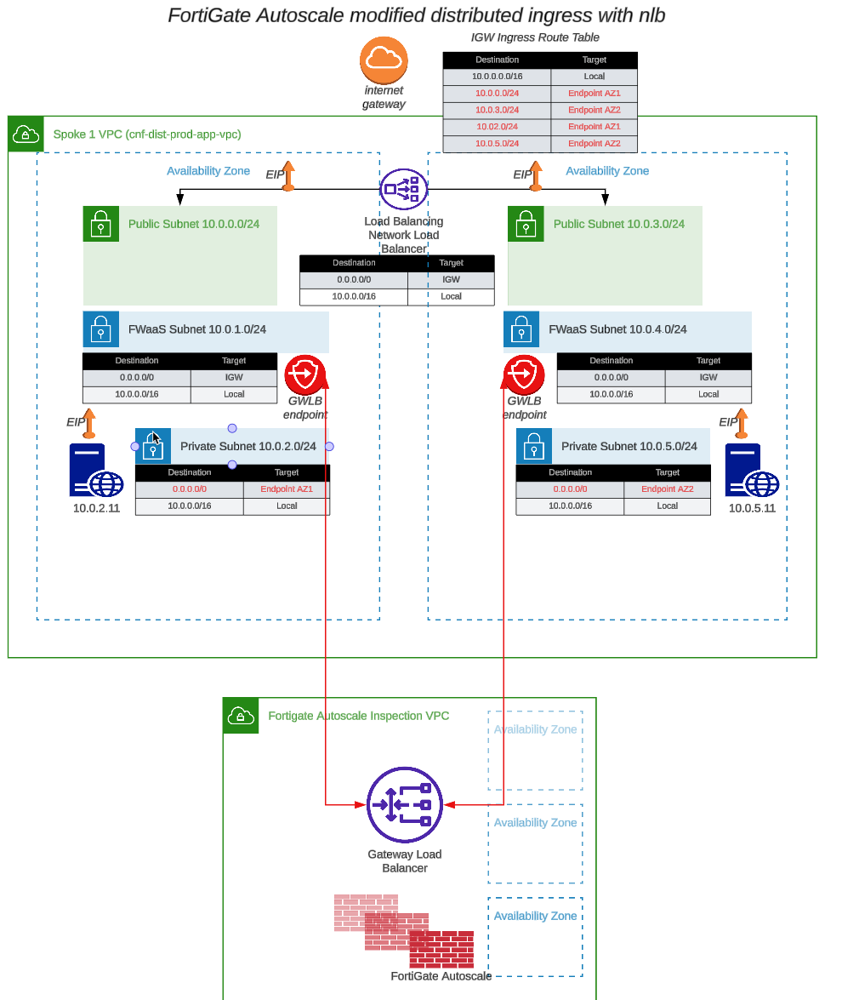
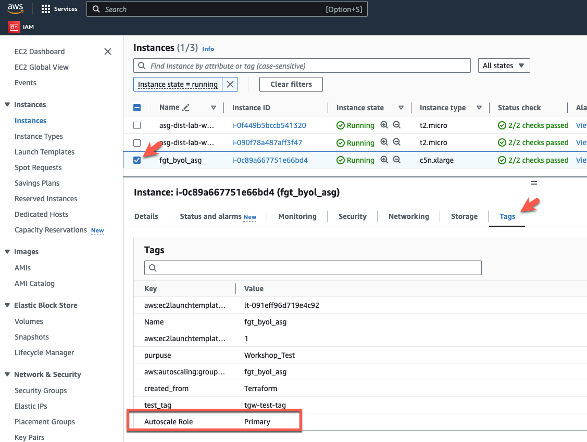
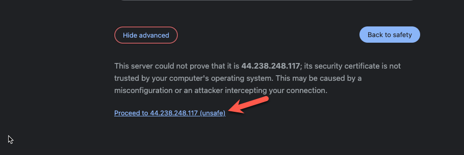
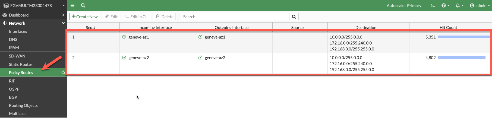

* The initial autoscale group is now deployed and supplied with a configuration that provides all the connectivity and routes needed to inspect traffic. The current policy set is a "DENY ALL" policy and the workload vpc route tables are redirecting ingress and egress traffic to the firewalls for inspection. This traffic should be sent to the firewalls on the geneve tunnels and security will be applied there. Let's do quick verification of the configuration and make sure everything looks correct. The initial deployment looks like the network diagram below: 

{}
**Note:** You may notice that you have lost connectivity to your ec2 instance in AZ1. This is because the modified route tables are sending traffic to the GWLBe's and the Fortigate has a default "DENY ALL" policy. We will fix this in the next task.
{}

* First, let's find the public IP of the primary instance of the FortiGate Autoscale Group. 
* Login to the AWS console and go to the EC2 console

* In this case, there is only one fgt_byol_asg instance, so this will be the primary. If you have multiple instances in the autoscale group, make sure you are logging into the primary instance by checking the TAGS for the instance. 
  * Pick the fgt_byol_asg instance and click on the TAGS tab.
  * Make sure you have chosen the "Autoscale Role =  Primary" instance

  * Now click on the Details tab and copy the Elastic IP address to your clipboard

  * Open a new tab your browser and login to the Fortigate console.
  * Click Advanced

  * Ignore the warning about the security certificate not being trusted and click "Proceed"

  * Login with username admin and the password you specified in the terraform.tfvars file when you deployed the autoscale group.
  * Answer the initial setup questions and complete the login.

* Now let's make sure the license applied and the configuration we passed in via the fgt_config.conf was applied.
  * First let's make sure the license was applied. 

  * Click on Network-> Interfaces and confirm the creation of the geneve tunnels.
  * Click the + sign on port1 and verify you have two geneve tunnels. The geneve tunnels are created by the autoscale lambda function. 
  * Make note of the Zone definition for "geneve-tunnels". This was created by the fgt_config.conf file we modified before deployment. All the data that is going to/from the workload vpc will be passed to the firewall for inspection via the geneve tunnels.

  * Click on "Policy Routes" and verify we have policy routes. These policy routes will force the traffic back to the geneve tunnel it originally came from. This allows the Fortigate to work with the GWLB regardless of what zone the traffic came from. This is important for cross-az load balancing. These policy routes are configured in fgt_config.conf.

  * Click on Policy & Objects -> Firewall Policy. Click the + sign next to Implicit. Here you can see that the only policy we have is the Implicit DENY ALL Policy. 

* The next task will create a policy that allows ingress and egress traffic and we can test with some traffic.

* This concludes this section.
