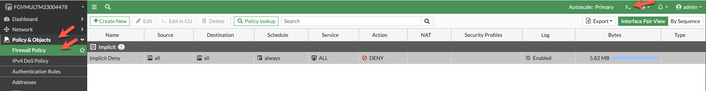
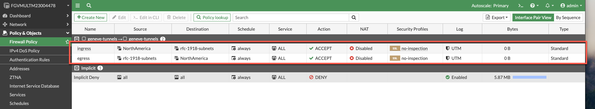
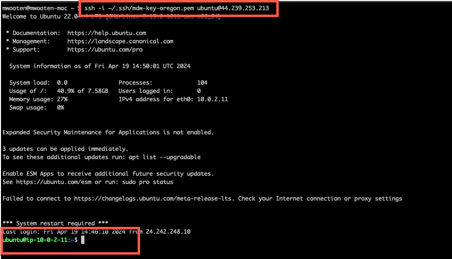
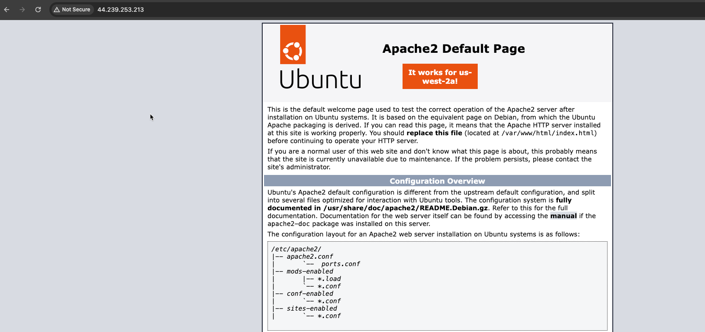
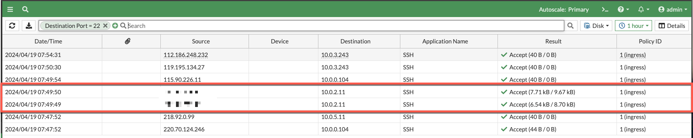

* The current policy set is a "DENY ALL" policy and the ec2 instances in the workload vpc are no longer reachable via ssh or http. Optionally, you can verify this by attempting to ssh into the AZ1 ec2 instance you were able to access before. Let's create a policy set that will allow us to access those instances again. Just for reference, here is the current network diagram:


* Let's create a couple of policies that allow ingress and egress traffic to pass through the firewall. I have included the CLI for convenience. You can paste this into the CLI from the console.

  * Copy the following text from the workshop into your copy&paste buffer
  * Click on the CLI icon. 
  * Paste the fortios cli into the prompt and type exit at the end.
  * Close the CLI.
  * Refresh your browser and you should see the policies applied.
  
  
  ```
  config firewall policy
  edit 0
      set name "ingress"
      set srcintf "geneve-tunnels"
      set dstintf "geneve-tunnels"
      set action accept
      set srcaddr "NorthAmerica"
      set dstaddr "rfc-1918-subnets"
      set schedule "always"
      set service "ALL"
      set logtraffic all
  next
     edit 0
      set name "egress"
      set srcintf "geneve-tunnels"
      set dstintf "geneve-tunnels"
      set action accept
      set srcaddr "rfc-1918-subnets"
      set dstaddr "NorthAmerica"
      set schedule "always"
      set service "ALL"
      set logtraffic all
  next 
  end
  
  ```
    




* Verify that you can now ssh into the ec2 instance in AZ1

  ``` ssh -i <keypair> ubuntu@<public ip> ```



* Verify you can access the Apache Server on the ec2 instance in AZ1



* Verify you are receiving the logs



* The next task will will manipulate the autoscale group.

* This concludes this section.
