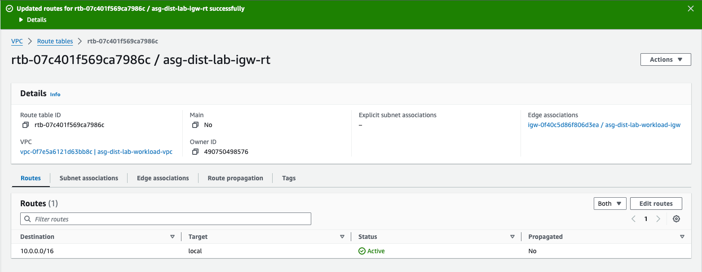
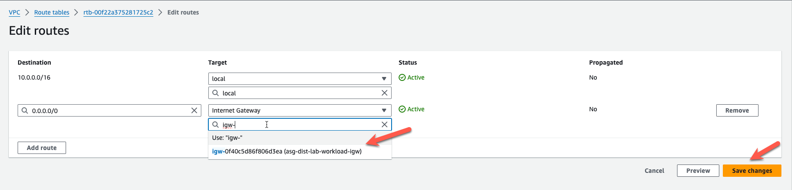
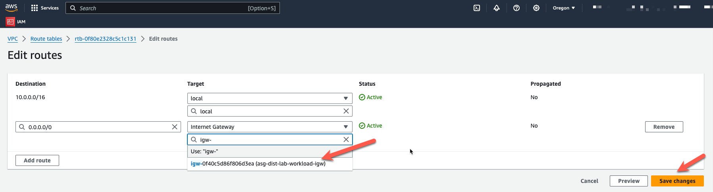
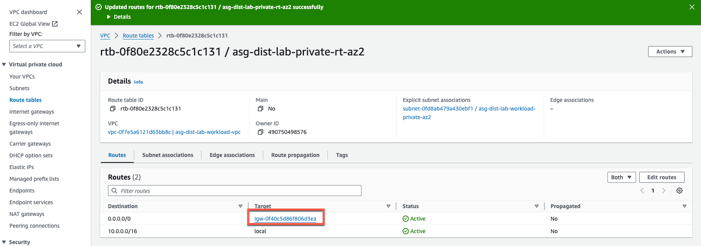
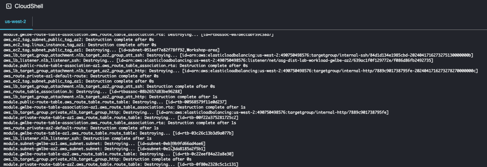

* Start by removing all routes in the Workload VPC that point to the autoscale endpoints that we created in Task5. The Terraform destroy will fail if you try to remove the endpoints with existing routes pointing to the endpoints. 
* Log into your AWS account and navigate to the [**Console Home**](https://us-west-2.console.aws.amazon.com/console/home?region=us-west-2#).
* Click on the VPC icon


* Click on "Route tables" in the left pane


* Highlight the IGW Ingress Route table named "cnf-dist-rec-igw-rt". 
* Click on the "Routes" tab at the bottom. 
* Click on "Edit routes".


* Remove the four routes that have a "Target" that points to a "vpce"
* Click "Save Changes"




* Highlight the private route table for AZ1.
* Click the "Routes" tab at the bottom
* Click "Edit routes"


* Change the default route target to the IGW in the VPC.
* Click "Save changes"




* Navigate back to the "Route tables" screen and change the default route for the private subnet in AZ2. 
* Click the "Routes" tab at the bottom
* Click "Edit routes"
* Change the default route target to the IGW in the VPC.
* Click "Save changes"





* Cleanup the terraform autoscale deployment. 
** ssh into the ec2 linux instance in AZ1

  ``` ssh -i <keypair> ubuntu@<public ip> ```

** cd to the deployment directory

  ``` cd terraform-aws-cloud-modules/examples/spk_gwlb_asg_fgt_gwlb_igw/ ```

** destroy the autoscale group using terraform destroy. (20-25 minutes)
** Wait for "destroy complete"

  ``` terraform destroy --auto-approve ```


* Now lets destroy the distributed egress workload vpc we created from AWS Cloudshell
* Log into your AWS account and navigate to the [**Console Home**](https://us-west-2.console.aws.amazon.com/console/home?region=us-west-2#).
* Click on the "AWS Cloudshell" icon
* cd tec-recipe-distributed-ingress-nlb/
* terraform destroy --auto-approve




* Wait for "destroy complete"


* We will be using this AWS Cloudshell account in the next task to deploy a Centralized Egress VPC. Make sure you cleanup the .terraform directory in the distributed ingress directory or you will not be able to deploy the VPC in the next task, because off the 1 GB disk space limit in AWS Cloudshell.

  ``` rm -rf .terraform .terraform.lock.hcl terraform.tfstate terraform.tfstate.backup ```

* This concludes this section and the workshop is complete.
