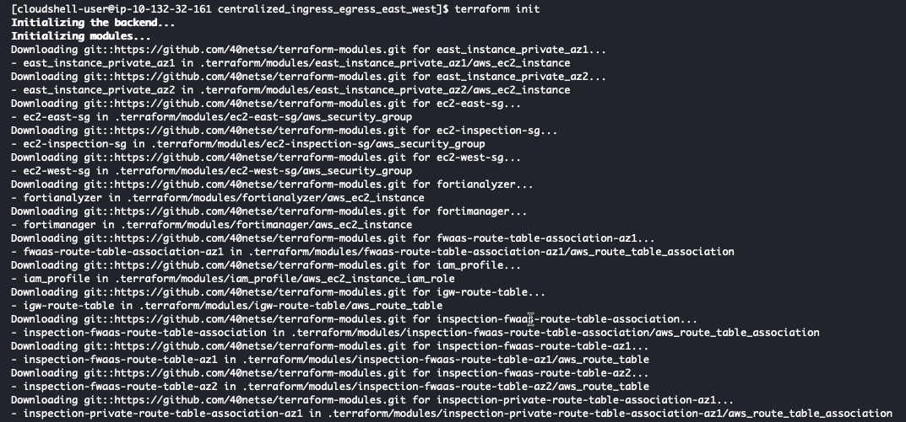

* Log into your AWS account and navigate to the [**Console Home**](https://us-west-2.console.aws.amazon.com/console/home?region=us-west-2#).

{}
**Note:** Make sure you are running this workshop in the intended region. The defaults are configured to run this workshop in us-west-2 (Oregon). Make sure your management console is running in us-west-2 (Oregon), unless you intend to run the workshop in a different supported region.
{}


* Click on the AWS CloudShell icon on the console navigation bar


* You should already have this repository cloned in your CloudShell environment from Task 2. If not, Clone a repository that uses terraform to create a centralized ingress workload vpc

  ``` git clone https://github.com/FortinetCloudCSE/FortiGate-AWS-Autoscale-TEC-Workshop.git ```

* Change directory into the newly created repository for centralized_ingress_egress_east_west

  ``` cd FortiGate-AWS-Autoscale-TEC-Workshop/terraform/centralized_ingress_egress_east_west ```
  
* Copy the terraform.tfvars.example to terraform.tfvars

  ``` cp terraform.tfvars.example terraform.tfvars ```
  


* Edit the terraform.tfvars file and insert the name of a valid keypair in the keypair variable name and save the file

{}
**Note:** Examples of preinstalled editors in the Cloudshell environment include: vi, vim, nano
{}

{}
**Note:** AWS Keypairs are only valid within a specific region. To find the keypairs you have in the region you are executing the lab in, check the list of keypairs here: AWS Console->EC2->Network & Security->keypairs. 
This workshop is pre-configured in the terraform.tfvars to run in the us-west-2 (Oregon) region. 
{}


* Insert the CDIR value (x.x.x.x/32) of your local IP (from whatsmyip.com) and we will not have to manually modify the security groups like we did in task3. 


* Modify the the cp and env variables to a value that is identifiable to you. e.g. cp = "cse-tec" and lab = "test". All the resources created by this template will be tagged with these values.mv 


* Modify the fortimanager_os_version and fortianalyzer_os_version to the version you want to use. 


* Use the "terraform init" command to initialize the template and download the providers

  ``` terraform init ```




* Use "terraform apply --auto-approve" command to build the vpc. This command takes about 10 minutes to complete.

``` terraform apply --auto-approve ```


* When the command completes, verify "Apply Complete" and valid output statements.
  * Make note of the jump box public ip (green arrow).
  * Copy the "Outputs" section to a scratchpad. We will use this info throughout this workshop.


* Now run the ./dump_workshop_info.sh script and copy the output to your scratchpad. The autoscale scripts will use this information to deploy the autoscale group into the existing vpc you just created. 

``` ./dump_workshop_info.sh ```


The network diagram for the centralized egress vpc looks like this:


* This concludes this section.
