* This task will deploy a FortiGate Autoscale group in the appropriate subnets of the centralized egress inspection vpc. Unfortunately, we will not be able to deploy the FortiGate Autoscale Group template from within AWS Cloudshell due to the 1GB disk space limitation of Cloudshell. If you take a look at the network diagram of the centralized egress workload vpc, you will see that a linux ec2 instance (jump box) was deployed in AZ1 with a public EIP address. This public IP address should be in the output of the template and you should have this saved in your scratchpad that was saved in the previous task. This ec2 instance is preconfigured with terraform and we will use this instance to clone and deploy the FortiGate Autoscale Group. 

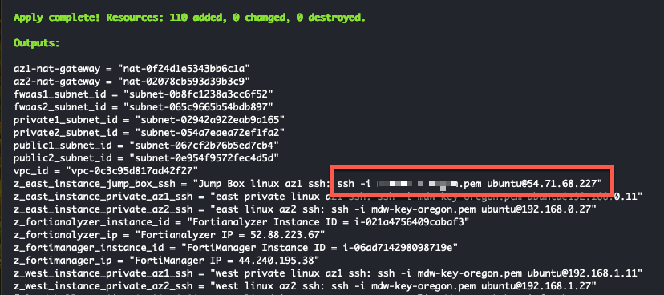

* Using a slightly modified command in your scratchpad, let's scp copy our licenses to the jump box. This will be on the machine that you use to store your FortiGate licenses. We will use these licenses to attach to the byol instances used in the deployment. This workshop will use two licenses. We will move these licenses to the appropriate place in a later step. 
  * Locate your licenses and put them in your current directory.
  * Substitute the keypair  and public IP into the command. 
  
  ``` scp -i <keypair> *.lic ubuntu@<public-ip>:~ ```

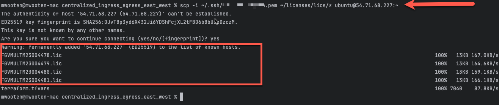

* ssh into the linux jump box using the command in your scratchpad.

  ``` ssh -i <keypair> ubuntu@<public-ip> ```

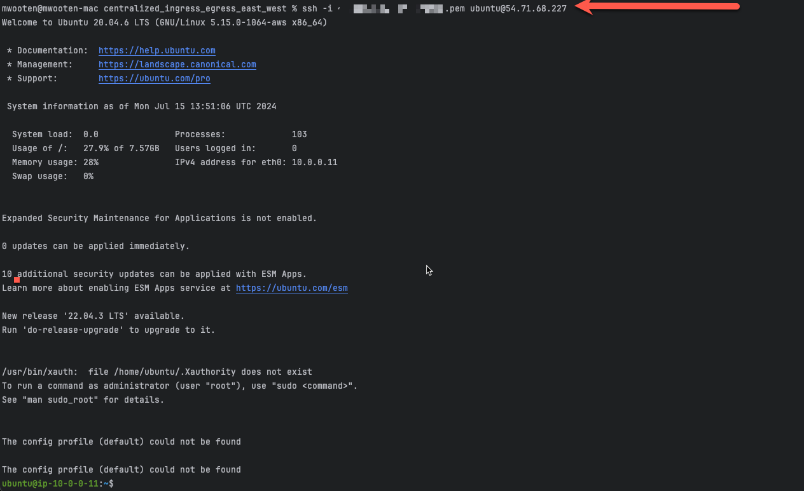

* There are a number of tasks that are executed due to the userdata template found in the cloudshell repo we just deployed. The details can be found in FortiGate-AWS-Autoscale-TEC-Workshop/terraform/centralized_ingress_egress_east_west/config_templates/web-userdata.tpl. Before continuing with the autoscale deployment, we need to allow the userdata to complete. Monitor the output in /var/log/cloud-init-output.log. When it is finished, you should see the output stop with the following message. 
* When the userdata configuration is complete, use ^C to exit from the "tail -f" command.

  ``` tail -f /var/log/cloud-init-output.log ```

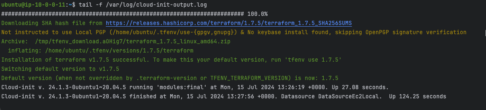

* First task is to provide the ec2 instance with your AWS account credentials. This will provide the necessary permissions to run the autoscale terraform templates. 
  * from the command line, run the aws configure and enter your access key, access secret, default region, and preferred output (text, json).
  
  ``` aws configure ```
  
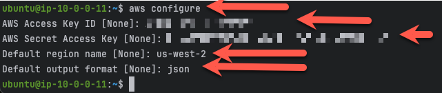

* The ec2 instance has been pre-configured to export your AWS credentials into the login environment variables. If you would like to investigate the specifics, see the web-userdata.tpl file in the config_templates directory of the templates we deployed in task 2. In order to export the credentials, we will need to logout and login again. Please check the values for the proper credentials.

    ``` exit ```

    ``` ssh -i <keypair> ubuntu@<public-ip> ```

    ``` env ```

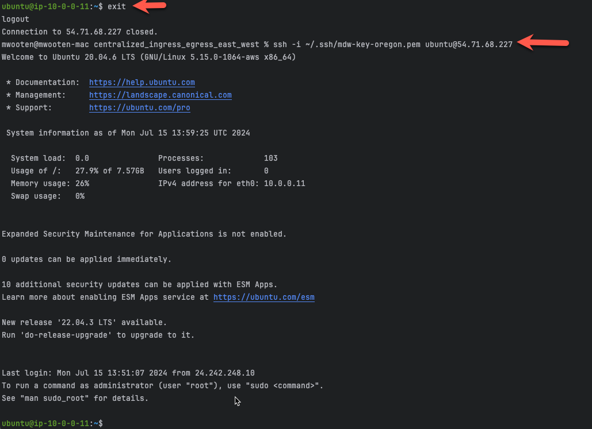
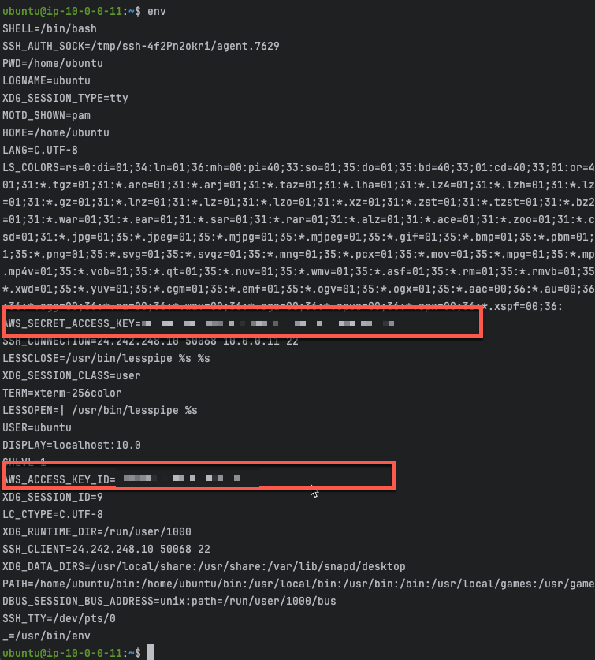

* Clone build 11 of the autoscale templates repository that uses terraform to create a distributed ingress workload vpc.

  ``` git clone https://github.com/fortinetdev/terraform-aws-cloud-modules.git ```

* Change directory into the newly created repository and move to the examples/spk_gwlb_asg_fgt_gwlb_igw directory. This directory will deploy a Fortigate Autoscale group with a Gateway Load Balancer and gateway load balancer endpoints in the appropriate subnets of the distributed ingress workload vpc. 

  ``` cd terraform-aws-cloud-modules/examples/spk_tgw_gwlb_asg_fgt_igw ```
  
* Copy the terraform.tfvars.example to terraform.tfvars

  ``` cp terraform.tfvars.txt terraform.tfvars ```
  
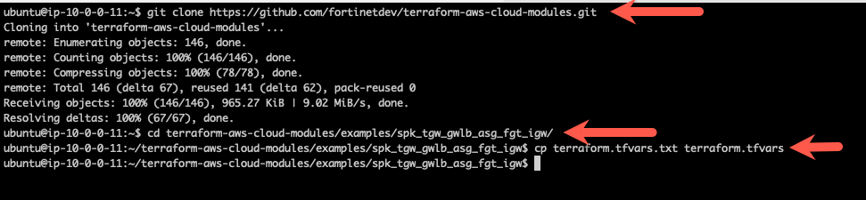

* Edit the terraform.tfvars file. Since you are not using AWS Cloudshell, then I recommend exporting your AWS credentials into your environment and not hard-coding your credentials into the terraform.tfvars file. You can find more information here: https://docs.aws.amazon.com/cli/latest/userguide/cli-configure-envvars.html. Luckily, the workshop already setup the ~/.bashrc to export the variables into your enviornment and you don't have to do anything.

{}
**Note:** You can find more information on exporting your AWS credentials into your environment here: https://docs.aws.amazon.com/cli/latest/userguide/cli-configure-envars.html
{}

{}
**Note:** Examples of preinstalled editors in the Cloudshell environment include: vi, vim, nano
{}

{}
**Note:** This task will create a Fortigate Autoscale deployment suitable for a customer demo environment. 
{}

{}
**Note:** Documentation for the template variables can be found here: https://github.com/fortinetdev/terraform-aws-cloud-modules/tree/main/examples/spk_gwlb_asg_fgt_gwlb_igw
{}

* This workshop will assume your access_key and secret_key are already exported into your environment. Remove the "access_key" and "secret_key" lines and fill in the "region" you intend to use for your deployment.

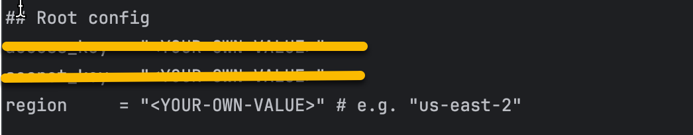

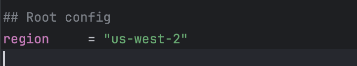

* Fill in the cidr_block you want to use for the inspection VPC. 
* Fill in the cidr_block you want to use for each spoke_vpc. Create  the spoke_cidr_list as a terraform list. 
* Create a terraform list for the set of availability_zones you want to use. 
{}
**Note:** us-west-2b does not support the service endpoint used by these templates. Use us-west-2c instead
{}

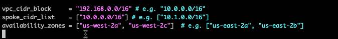

* Fill in the desired fgt_intf_mode. 1-arm mode uses a single Fortigate ENI and hairpins the traffic in and out of the same ENI. 2-arm mode uses two Fortigate ENIs and allows for a more traditional routing configuration via a public and private interface. 
* This workshop will use the 2-arm mode. 

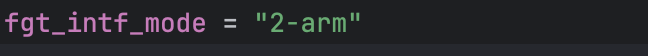

* Each Fortigate Autoscale deployment using standard BYOL and PayGo licensing will create 2 autosclale groups. The BYOL autoscale group will use the BYOL licenses found in the license directory. If more instances are needed to handle the load on the autoscale group, Fortigate Autoscale will scale-out using PayGo instances if all BYOL licenses are consumed. Lets fill in the BYOL section of the template.
* Fill in the byol section with values for the highlighted variables:
  * template_name = anything
  * fgt_version = desired fortios version
  * license_type = leave as byol
  * fgt_password = desired fortigate password when logging into the fortigate
  * keypair_name = keypair used for passwordless login
  * lic_folder_path = path to Fortigate byol licenses
  * asg_max_size = maximum number of instances in the autoscale group
  * asg_min_size = minimum number of instances in the autoscale group
  * asg_desired_capacity = desired number of instances in the autoscale group **(we will leave desired at one until we get everything configured)**
  * user_conf_file_path provides configuration cli to preconfigure the fortigates. Leave this variable as-is. The workshop included a pre-confiured fgt_conf.conf file in the home directory. We will copy the pre-made fgt_config.conf file into place in a few steps
  * leave the rest of the variables as-is
  
  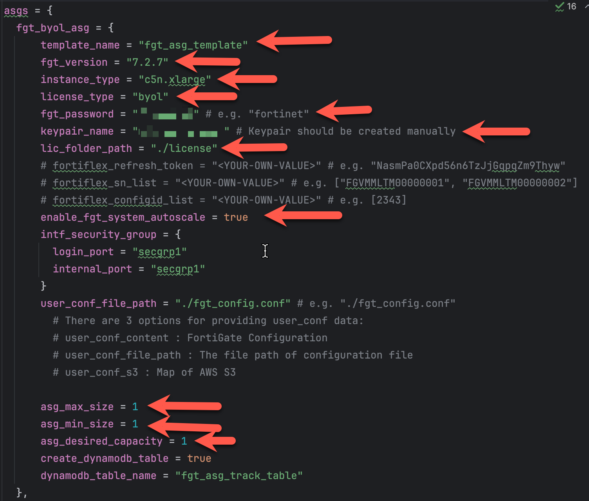

* Fill in the on_demand (on_demand) section with values for the highlighted variables:
  * template_name = anything
  * fgt_version = desired fortios version
  * license_type = leave as on-demand
  * fgt_password = desired fortigate password when logging into the fortigate
  * keypair_name = keypair used for passwordless login
  * asg_max_size = maximum number of on-demand instances in the autoscale group
  * asg_min_size = Leave minimum set to 0. We want paygo autoscale to scale-in back to 0 if the instances are not needed.
  * asg_desired_capacity = Leave desired set to 0. We want on-demand to only scale as a result of an autoscale event. 
  * user_conf_file_path provides configuration cli to preconfigure the fortigates. Leave this variable as-is. The workshop included a pre-confiured fgt_conf.conf file in the home directory. We will copy the pre-made fgt_config.conf file into place in a few steps
  * leave the rest of the variables as-is

    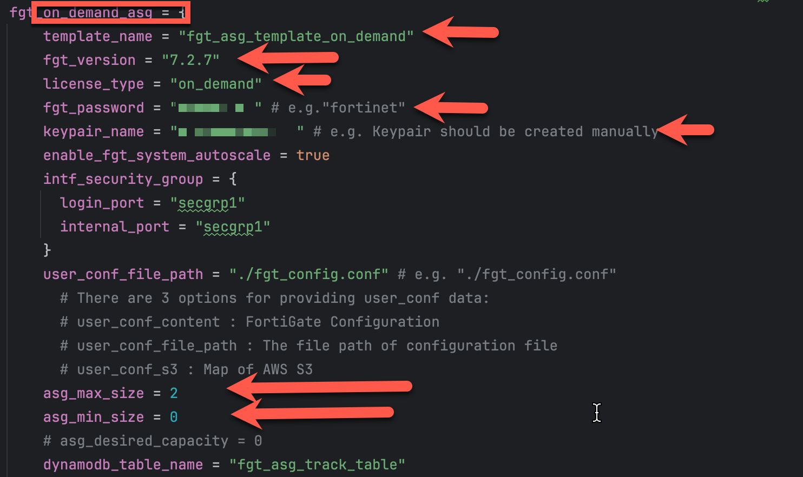

* The scale policies control the scaling of the autoscale groups. The scale policies are based on the average CPU utilization of the autoscale group. The scale policies are set to scale out when the average CPU utilization is greater than 80% and scale in when the average CPU utilization is less than 30%. The scale policies are set to scale out and in by 1 instance. This workshop will leave the scaling policies as is.

  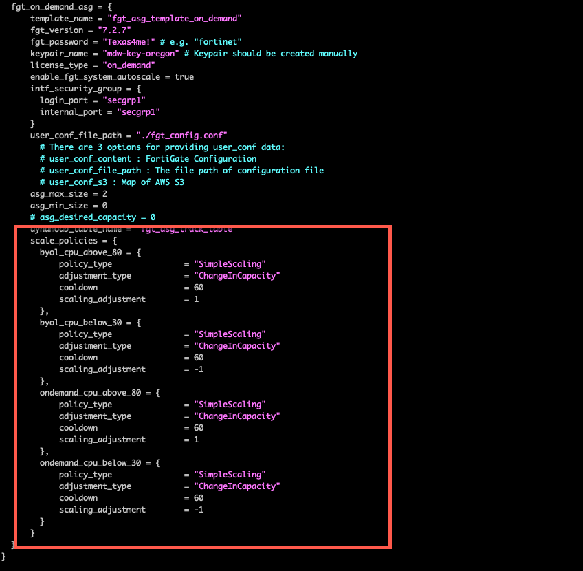

* Delete the blank existing_security_vpc, existing_igw, existing_tgw, and existing_subnets sections. These would be used in a non-workshop environment and you would need to manually provide the security_vpc_id, leave the igw_id as "",  leave the existing_tgw empty, and match internal subnets to private, gwlbe as middle tier subnets where gwlb endpoints are deployed, and login subnets as public subnets. This workshop uses some well-defined tags and uses the dump_work_info.sh script to dump the proper stanza. This was saved in your scratchpad. 

  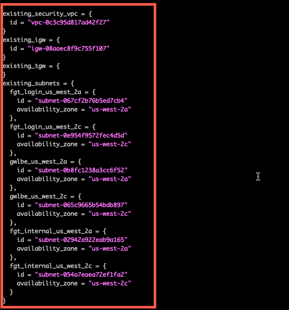

* Substitute the scratchpad info for the deleted section in this workshop. 

  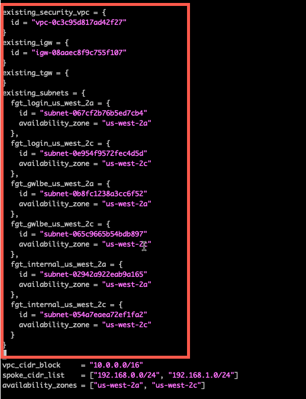

* Set enable_cross_zone_load_balancing to true. This will allow the Gateway Load Balancer to distribute traffic across all instances in all availability zones.
* Set general_tags to anything you like. Each resource created by the template will have these tags.        

  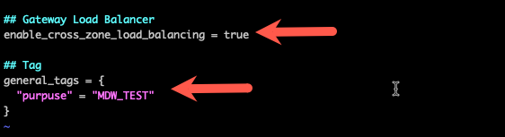

{}
**Note:** Monitor this mantis for updates on the ability to automatically modify the necessary routes into the workload vpc: https://mantis.fortinet.com/bug_view_page.php?bug_id=1021311
{}

  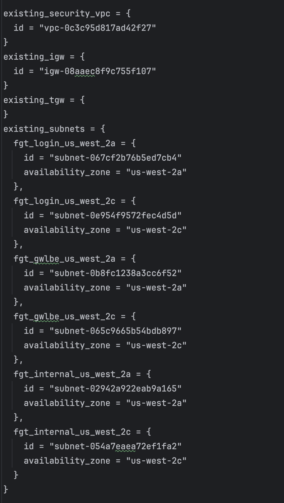

* Now copy the fgt_config.conf file we want to use into the repository. Feel free to take a look to see what is preconfigured.
* Now copy the license files you copied over and put them in ***license*** directory. 
* Remove the example license file "license1.lic". The autoscale lambda function will mistakenly attach this file as a valid license if you leave it in the directory.

  ``` cp ~/fgt_config.conf ./fgt_config.conf ```

  ``` mv ~/*.lic ./license ```

  ``` rm license/license1.lic ```

  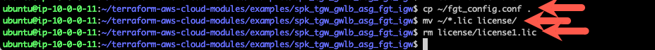

* Use the "terraform init" command to initialize the template and download the providers

  ``` terraform init ```

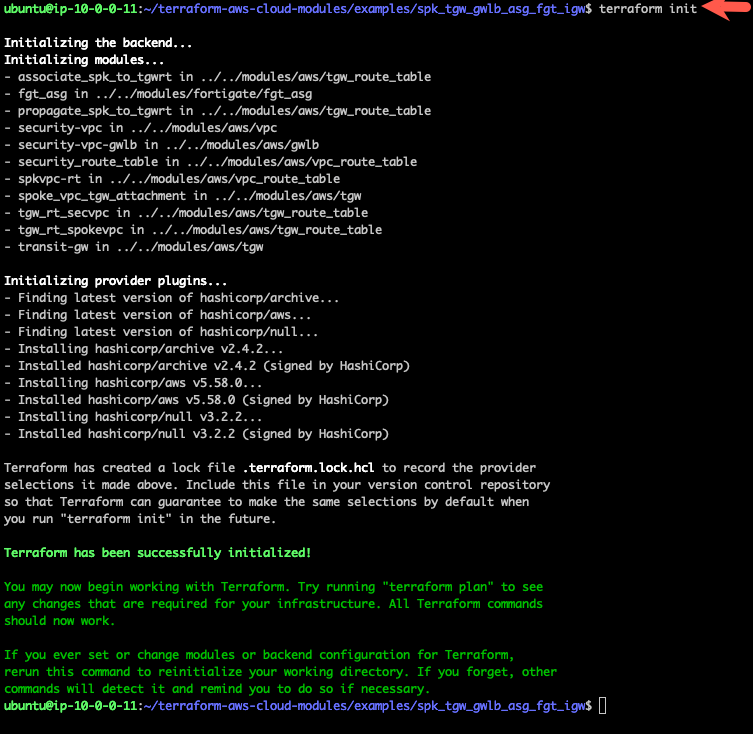

* Use "terraform apply --auto-approve" command to build the vpc. This command takes about 20 minutes to complete.

``` terraform apply --auto-approve ```

* When the command completes, verify "Apply Complete" and valid output statements.

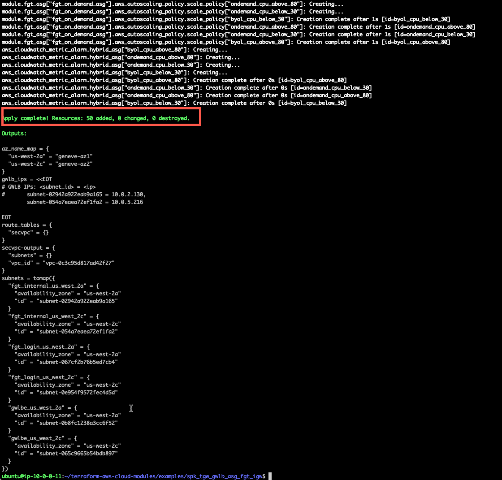

* Now we have a FortiGate Autoscale group deployed in the inspection VPC and endpoints deployed in the middle tier of subnets. The endpoints will be deployed in the existing subnets that are denoted as "gwlbe_<whatever>".

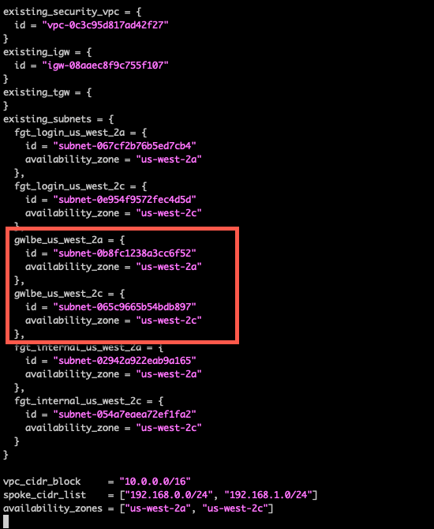

* The network diagram looks like this. In the next task, we will modify the route tables to redirect the traffic to the GWLB Endpoints, so the FortiGates will receive the connections for inspection.


* This concludes this section.


