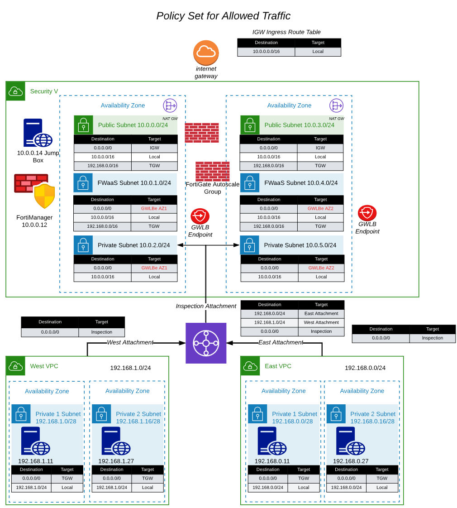

* The initial deployed terraform template is a working deployment with ingress traffic NAT'd to all of the EIP's by the IGW. Spoke VPC instances do not have public IP's associated, so those instances are not directly reachable from the Internet. The spoke instance can egress to the internet through the TGW. Egress traffic is sent to the NAT Gateway by a default route in each route table pointing to the NAT Gateway in the same AZ. The initial deployment will not have any security, except for the security groups. 

* Once we deploy a FortiGate Autoscale Group and the associated endpoints, we will need to modify the inspection public route tables to redirect traffic going to the spoke VPC CIDRs to the GWLB Endpoints for the FortiGate instances to inspect the traffic. To redirect egress traffic, change the default route in the private route table to point to the GWLB endpoint. The modified route table entries are in RED in the picture above.

{}
**Note:** Changes to the route tables are in RED.
{}

## ** Modify the following routes in the Inspection VPC Route Tables **
|                        |    |    |
|------------------------| ---- | ---- |
| Route Table Name       | CIDR Block | Target |
| inspection private AZ1 | 0.0.0.0/0 | GWLBe in AZ1 |
| inspection private AZ2 | 0.0.0.0/0 | GWLBe in AZ2 |
| inspection fwaas AZ1   | 0.0.0.0/0 | GWLBe in AZ1 |
| inspection fwaas AZ2   | 0.0.0.0/0 | GWLBe in AZ2 |

* Log into your AWS account and navigate to the [**Console Home**](https://us-west-2.console.aws.amazon.com/console/home?region=us-west-2#).
* Click on the VPC icon

* Now let's modify the route tables. Click on "Route tables" in the left pane

* Choose the private route table for the inspection VPC in AZ1. 
* Click on the "Routes" tab at the bottom. 
* Click on "Edit routes".

* Change the default route to point to the GWLBe in the same AZ. 
* Click "Save Changes".

* Return to the "Route Tables"  screen

* Choose the private route table for the inspection VPC in AZ2. 
* Click on the "Routes" tab at the bottom. 
* Click on "Edit routes".

* Change the default route to point to the GWLBe in the same AZ. 
* Click "Save Changes".

* Return to the "Route Tables"  screen

* Choose the fwaas route table for the inspection VPC in AZ1. 
* Click on the "Routes" tab at the bottom. 
* Click on "Edit routes".

* Change the default route to point to the GWLBe in the same AZ. The default route was pointing at the NAT Gateway to allow spoke instances access to the internet without firewall inspection. Redirecting the default route to the GWLB endpoint will send the traffic to the Fortigate for inspection.
* Click "Save Changes".

* Return to the "Route Tables"  screen

* Choose the fwaas route table for the inspection VPC in AZ2. 
* Click on the "Routes" tab at the bottom. 
* Click on "Edit routes".

* Change the default route to point to the GWLBe in the same AZ. 
* Click "Save Changes".

* Ingress and Egress traffic is now being sent to Fortigate ASG for inspection.

* The next task will create a "Policy Set" for Fortigate ASG and this will allow us to create a security policy and log the traffic.

* This concludes this section.
