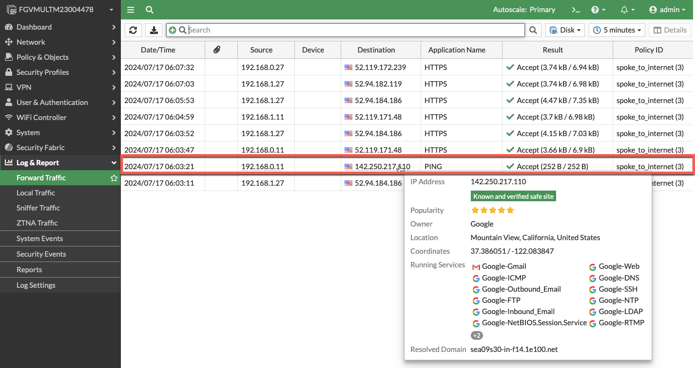

* The current policy set is a “DENY ALL” policy and the ec2 instances in the workload vpc are no longer reachable via ssh or http. Optionally, you can verify this by attempting to ssh into the AZ1 ec2 instance you were able to access before. Let’s create a policy set that will allow us to access those instances again. Just for reference, here is the current network diagram:


* Let’s create a couple of policies that allow ingress and egress traffic to pass through the firewall. I have included the CLI for convenience. You can paste this into the CLI from the console.

  * Copy the following text from the workshop into your copy&paste buffer
  * Click on the CLI icon.
  * Paste the fortios cli into the prompt and type exit at the end.
  * Close the CLI.
  * Refresh your browser and you should see the policies applied.
  * Let’s discuss the following policy entries:
    * The first policy allows east-west traffic between the spoke vpc instances.
    * The second policy allows spoke traffic to egress to the internet and NAT behind the EIP of the FortiGate instance. This rule is taking advantage of the GEO-IP feature of the FortiGate and only allows spoke vpc instances to send traffic to North America IP addresses.

  
  ```
  config firewall policy
  edit 0
      set name "ingress"
      set srcintf "geneve-tunnels"
      set dstintf "geneve-tunnels"
      set action accept
      set srcaddr "rfc-1918-subnets"
      set dstaddr "rfc-1918-subnets"
      set schedule "always"
      set service "ALL"
      set logtraffic all
  next
     edit 0
      set name "spoke_to_internet"
      set srcintf "geneve-tunnels"
      set dstintf "port2"
      set action accept
      set srcaddr "rfc-1918-subnets"
      set dstaddr "NorthAmerica"
      set schedule "always"
      set service "ALL"
      set logtraffic all
      set nat enable
  next 
  end
  
  ```
    


* Verify that you can now ssh from the jump box (10.0.0.11) into the ec2 instance in AZ1. This connection is handled by the route tables as local traffic and does not pass through the firewall.
* Verify that you can egress through the firewall to the internet. Don’t forget that your policy limits you to North America IP addresses.

  ``` ssh -i <keypair> ubuntu@<public ip> ```

  ``` ping google.com ```


* Verify you are receiving the logs



* Verify you can pass east-west traffic through the firewall by pinging the ec2 instance in the west VPC from the east VPC.

* 

* Verify you are receiving the logs

* 

* The next task will scale-out the FortiGate autoscale group.

* This concludes this section.
