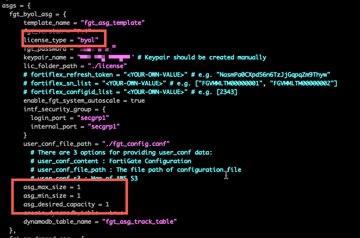
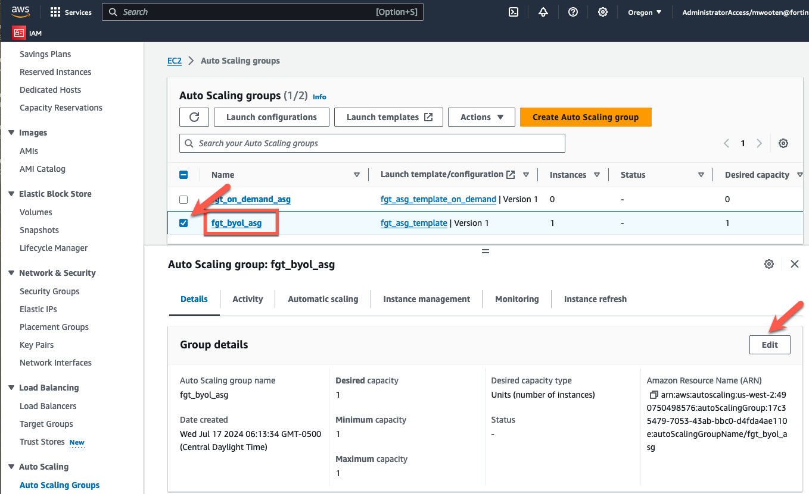
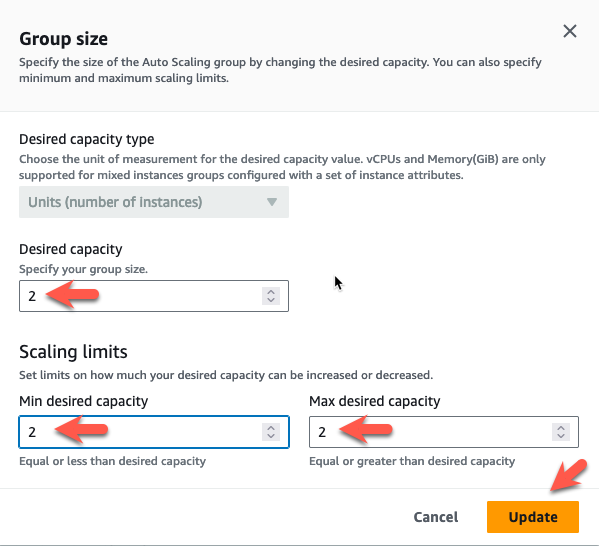
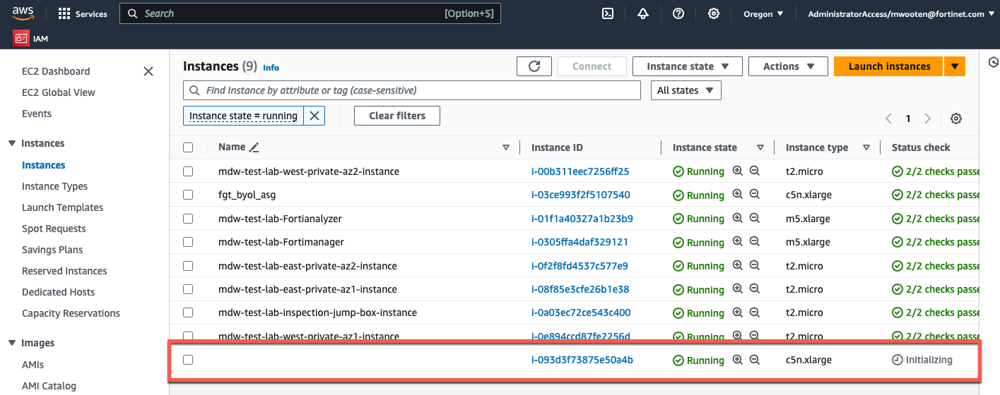
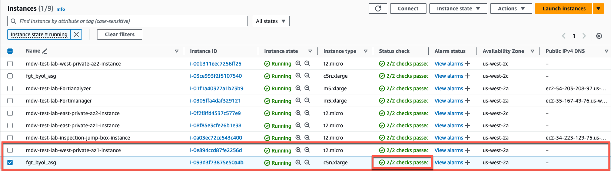
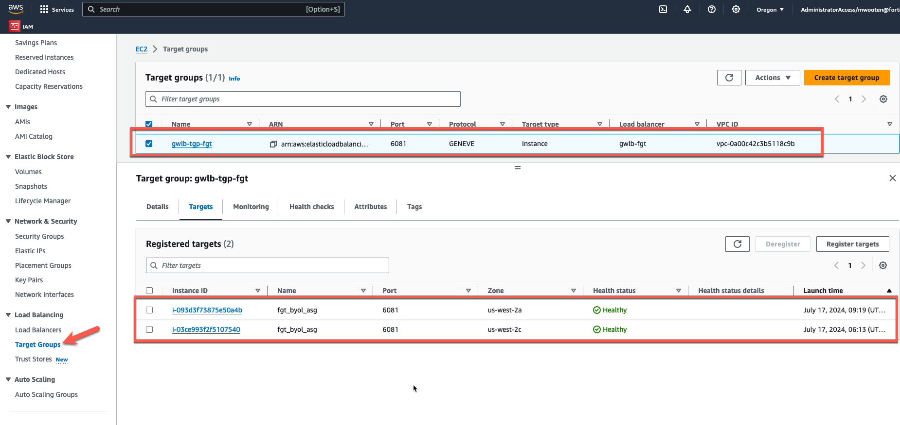

* In the initial deployment, we defined the byol autoscale group to be min,max,desired = 1. Having only a single instance in the autoscale group makes it easier to verify traffic flows and get everything configured. From terraform.tfvars:

* If you would like to see the instances scale-out, change the autoscale configuration to min=0, max=2, desired=2, via the AWS Console. 
    * Navigate to EC2->Autoscaling Groups
    * Choose the fgt_byol_asg and under Group Details choose Edit
    * Set min,max,desired = 2 and click Update

* Navigate to EC2->Instances and you should see a new instance spin up after a minute or so. After a few minutes, the instance should pass health checks and get added to the target group for the Gateway Load Balancer.

* Feel free to start passing some traffic flows through the autoscale group.

{}
**Note:** Now that you have scaled-out to multiple instances, in multiple availability zones, you may find it difficult to anticipate which Fortigate will inspect and log the traffic. This illustrates why it very helpful to use FortiAnalzyer as a log collector when using an autoscale group.
{}

* This concludes this section