* Start by removing all routes in the Workload VPC that point to the autoscale endpoints that we created in Task5. The Terraform destroy will fail if you try to remove the endpoints with existing routes pointing to the endpoints. 
* Log into your AWS account and navigate to the [**Console Home**](https://us-west-2.console.aws.amazon.com/console/home?region=us-west-2#).
* Click on the VPC icon


* Click on "Route tables" in the left pane

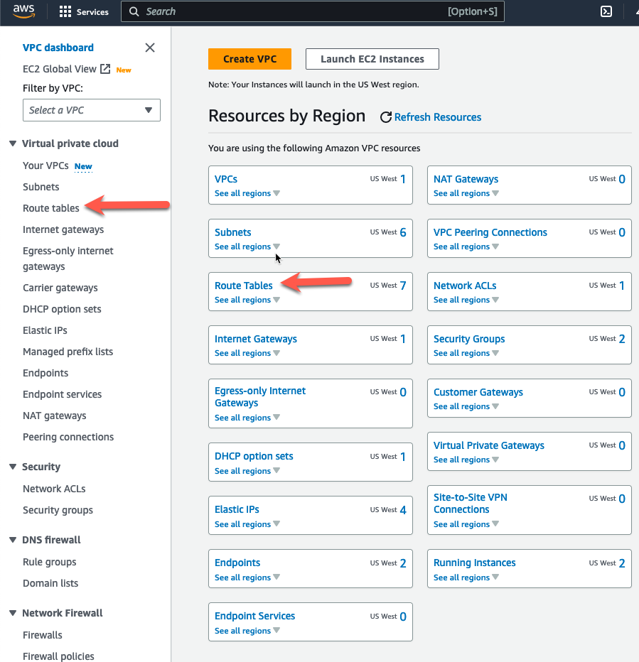

* Highlight the private route table for AZ1.
* Click the "Routes" tab at the bottom
* Click "Edit routes"

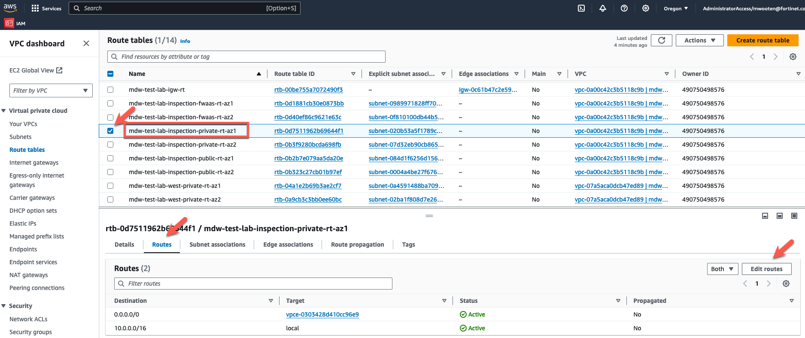

* Remove the default route that points to the GWLB endpoint in AZ1. If you want to put it back the way it was before our testing, point the default route to the NAT Gateway in the same AZ. We are just going to teardown all the VPC's, so it doesn't matter in this case. 
* Click "Save changes"

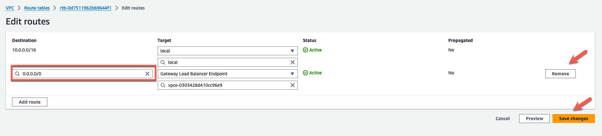

* Click on "Route tables" in the left pane


* Highlight the private route table for AZ2.
* Click the "Routes" tab at the bottom
* Click "Edit routes"

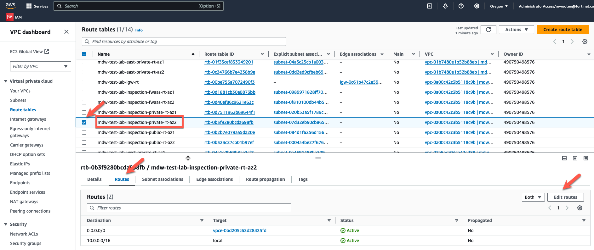

* Remove the default route that points to the GWLB endpoint in AZ1. If you want to put it back the way it was before our testing, point the default route to the NAT Gateway in the same AZ. We are just going to teardown all the VPC's, so it doesn't matter in this case. 
* Click "Save changes"

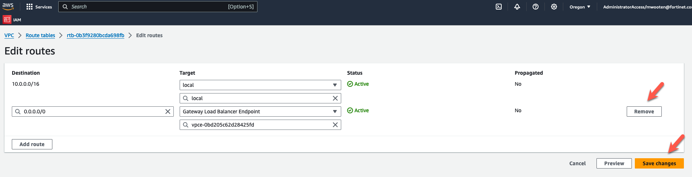

* Click on "Route tables" in the left pane


* Highlight the fwaas route table for AZ1.
* Click the "Routes" tab at the bottom
* Click "Edit routes"

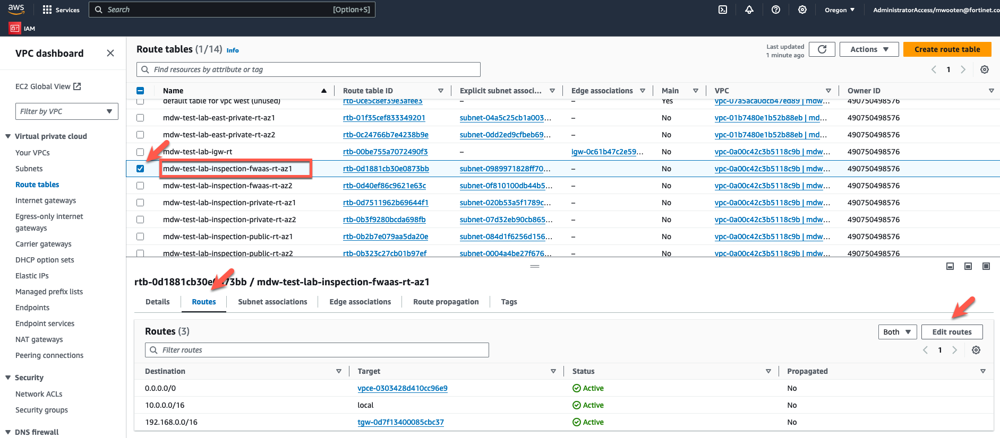

* Remove the default route that points to the GWLB endpoint in AZ1. 
* Click "Save changes"

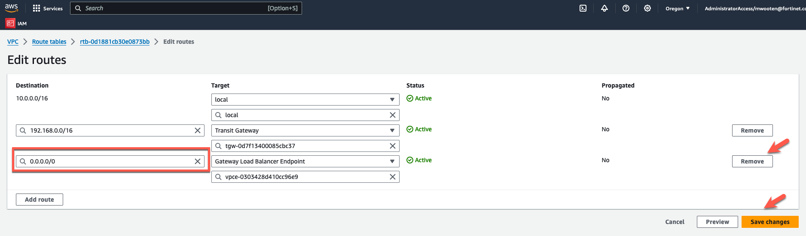

* Click on "Route tables" in the left pane


* Highlight the fwaas route table for AZ2.
* Click the "Routes" tab at the bottom
* Click "Edit routes"

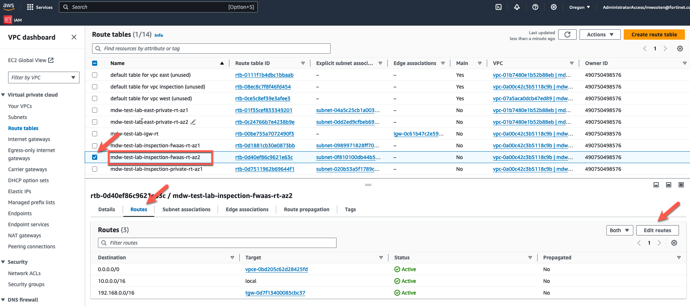

* Remove the default route that points to the GWLB endpoint in AZ1. 
* Click "Save changes"


* Cleanup the terraform autoscale deployment. 
** ssh into the ec2 linux jumpbox using the IP address in your scratchpad.

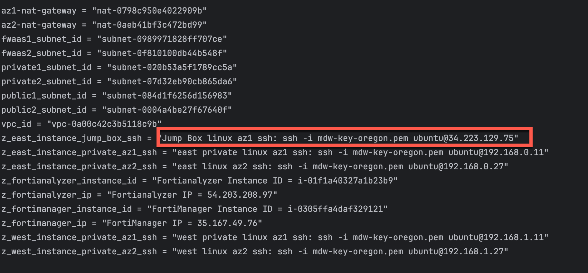

  ``` ssh -i <keypair> ubuntu@<public ip> ```

** cd to the deployment directory

  ``` cd terraform-aws-cloud-modules/examples/spk_tgw_gwlb_asg_fgt_igw/ ```

** destroy the autoscale group using terraform destroy. (20-25 minutes)
** Wait for "destroy complete"

  ``` terraform destroy --auto-approve ```

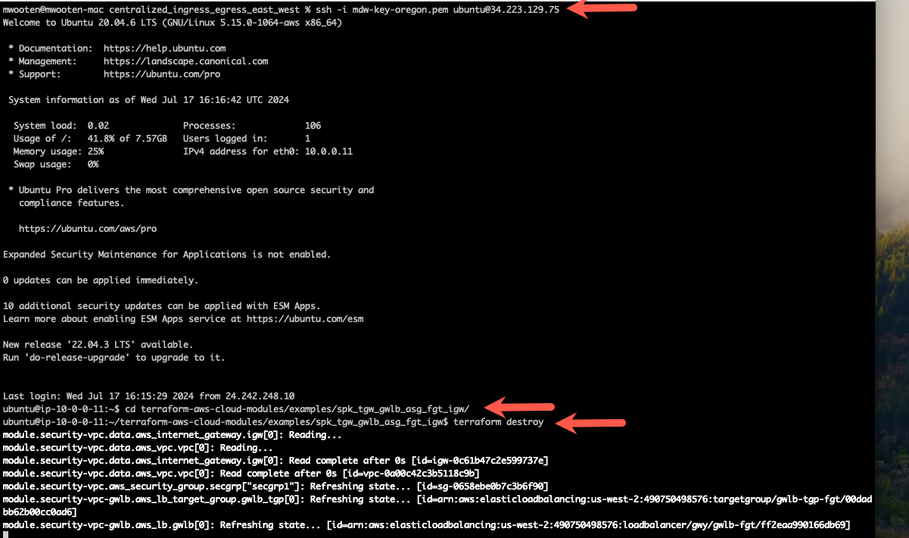
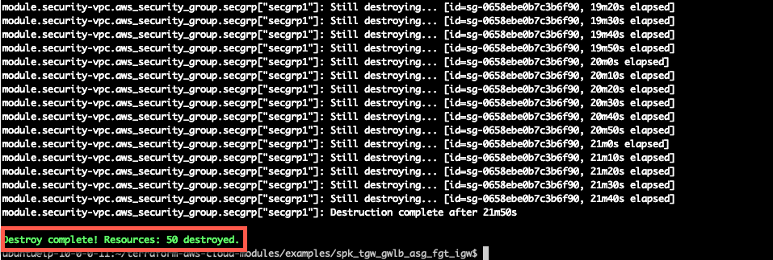

* Now lets destroy the centralized egress workload vpc we created from AWS Cloudshell
* Log into your AWS account and navigate to the [**Console Home**](https://us-west-2.console.aws.amazon.com/console/home?region=us-west-2#).
* Click on the "AWS Cloudshell" icon
* change directory into the centralized egress directory
* issue the command to destroy the terraform deployment

  ``` cd FortiGate-AWS-Autoscale-TEC-Workshop/terraform/centralized_ingress_egress_east_west/ ```
  ``` terraform destroy --auto-approve ```

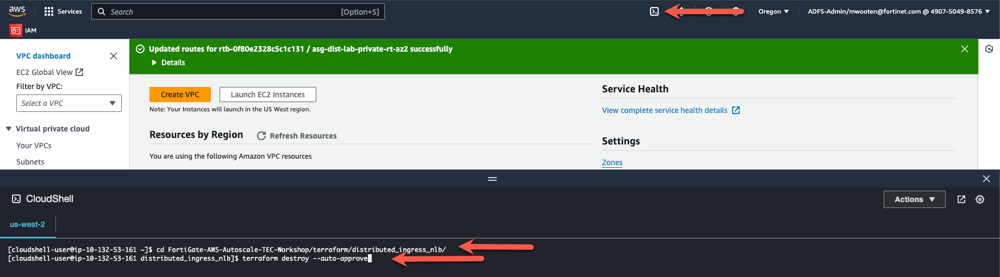
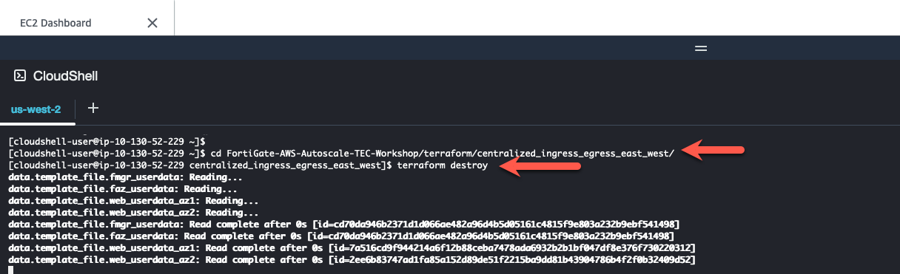

* Wait for "destroy complete"

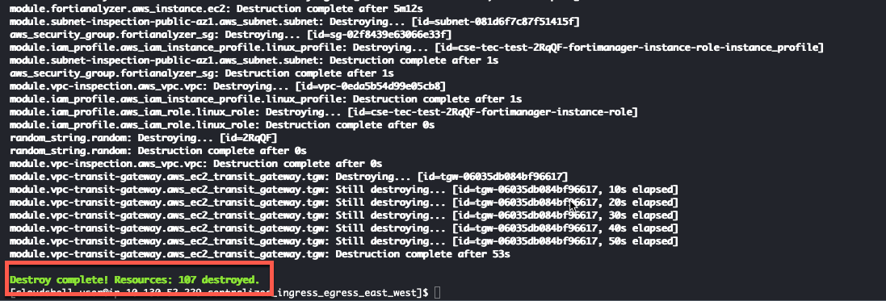

* Cleanup the terraform state files and lock files.

  ``` rm -rf .terraform .terraform.lock.hcl terraform.tfstate terraform.tfstate.backup ```

* This concludes this section and the workshop is complete.
